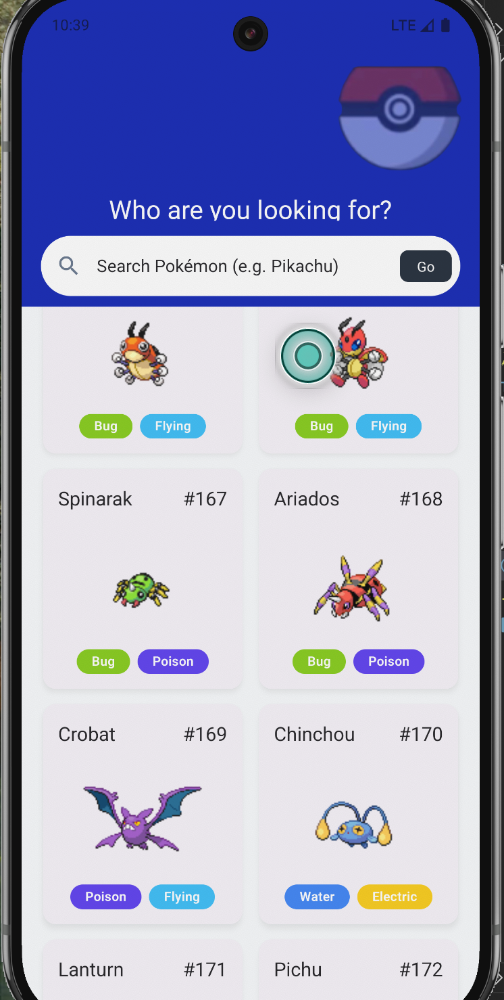
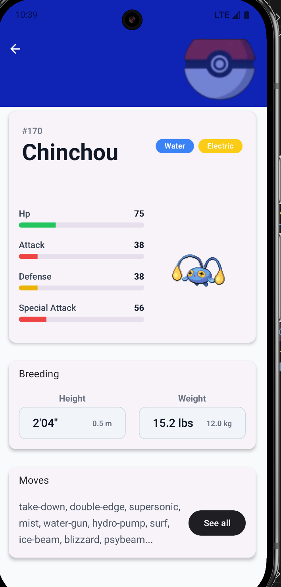

# Pokémon App

A modern, clean React Native application built with Expo and TypeScript. Browse Pokémon in a beautiful grid, search by name, and view detailed information with stats, types, and more.

## Features

- Responsive 2-column Pokémon grid
- Real-time search functionality
- Detailed Pokémon pages (stats, types, height, weight, moves)
- Proper loading and error states
- Fully typed with TypeScript
- Clean architecture with custom hooks and services
- Modern styling using NativeWind (Tailwind CSS)

## Project Structure

```bash
src/
├── app/                          # Expo Router pages
│   ├── _layout.tsx
│   ├── index.tsx                 # Home screen
│   └── pokemon/
│       └── [id].tsx              # Pokémon detail screen
│
├── components/                   # Reusable UI components
│   ├── PokemonCard.tsx
│   ├── TypeBadge.tsx
│   ├── StatBar.tsx
│   ├── LoadingScreen.tsx
│   └── ErrorScreen.tsx
│
├── hooks/                        # Custom hooks
│   └── usePokemon.ts             # usePokemonList & usePokemonDetails
│
├── services/                     # API services
│   ├── client.ts                 # Axios client
│   └── pokemon.ts                # Pokémon API service
│
├── config/                       # Configuration
│   └── env.ts                    # Environment configuration
│
├── constants/                    # Constants
│   └── typeColors.ts             # Pokémon type colors
│
├── types/                        # TypeScript definitions
│   └── index.ts
│
├── utils/                        # Utilities
│   └── apiError.ts               # Error handling
│
└── .env                          # Environment variables (not committed)
🚀 Getting Started
Prerequisites

Node.js (v18 or higher)
Expo CLI

Installation

Clone the repository: https://github.com/Yohannes14/expo-app.git
cd expo-app
Install dependencies:npm install
# or
yarn install
Start the development server:npx expo start
Run the app:
Press i for iOS Simulator
Press a for Android Emulator
Scan QR code with Expo Go app on your phone


 Configuration
Environment Variables

Create a .env file in the root of the project:env# .env
# .env
EXPO_PUBLIC_API_BASE_URL=https://pokeapi.co/api/v2
EXPO_PUBLIC_API_TIMEOUT=10000

# .env.production (auto-loaded in prod builds)
EXPO_PUBLIC_API_BASE_URL=https://pokeapi.co/api/v2
EXPO_PUBLIC_ENABLE_LOGGING=false
Add .env to .gitignore:gitignore.env
Environment config is defined in src/config/env.ts.

📱 Usage

Home Screen: Browse and search Pokémon
Detail Screen: Tap any Pokémon card to view full details
Search: Type in the search bar to filter Pokémon instantly

 Architecture

Custom Hooks for data fetching logic
Services Layer for clean API calls
Reusable Components with proper TypeScript props
Centralized Error Handling using custom ApiError

 Styling

NativeWind (Tailwind CSS) for clean and maintainable styles
Consistent Pokémon type color system

 Future Enhancements

Infinite scrolling and pagination
Favorites / Wishlist feature
Dark mode support
Pull-to-refresh

##  Screenshots

### Home Screen


### Details Screen



Acknowledgments

PokeAPI for the Pokémon data
Expo for the amazing development experience
React Native community

```
